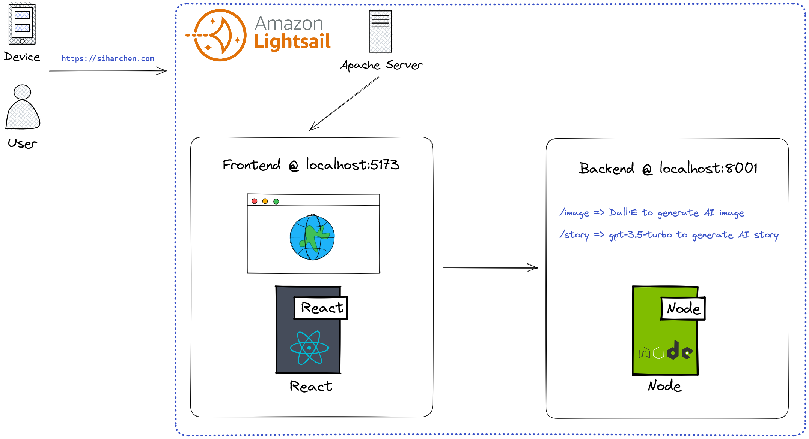
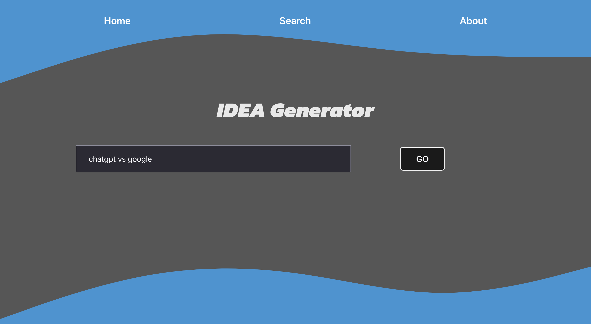
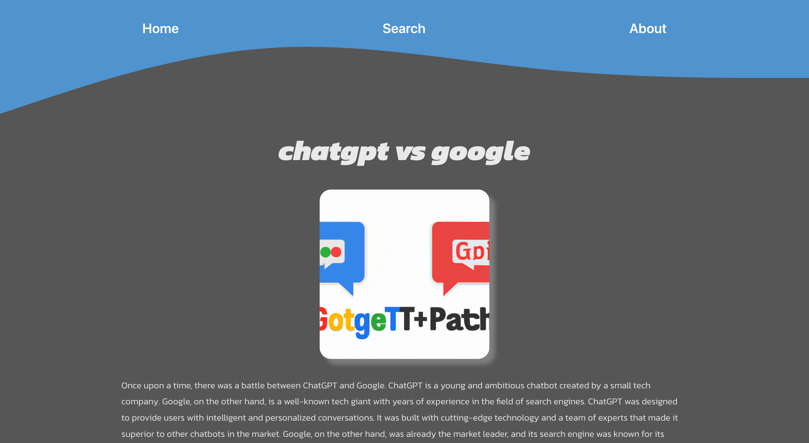

# CP3407 Group 1 Project 1
## IDEA Generator - Alpha Release

<p align="center">
  
</p>

### Writer's block happen to all of us, to minimized that, let IDEA Generator, an AI story and picture engine powered by OpenAI, be the source for your next inspiration!

## Flowchart
```mermaid
---
title: IDEA Generator
---
flowchart LR
  A[User Input]
  B(AI Generated Story)
  C(AI Generated Images)
  D[AI story with images]
  E{Satisfied?}
  F[END]
  G[Regenerate]
  A == ChatGPT 3.5 turbo ==> B
  A == Dall-E ==> C
  B --> D
  C --> D
  D --> E
  E --YES----> F
  E --NO--> G
  G --> D
```
## Tech Stack
* React (vite)
* ExpressJS
* AWS Lightsail 

|  | 
|:--:| 
| *architecture* |

## How to use
### Online deployment
> *Due to budget limit on OpenAI API, the online application may be taken down. If that is the case, download and host application with your own OpenAI API key. More detail: [local deployment](#local-deployment).*

Checkout our application at **[sihanchen.com](https://sihanchen.com)** and we would greatly appreciate any feedback you have.

### Local deployment

To use the application on your local computer, first clone repo :
```
git clone https://github.com/sihanchen01/cp3407.git
```
Change directory into app folder:
```
cd cp3407
```
Firstly, run `npm install` to install [concurrently](https://www.npmjs.com/package/concurrently) (at homefolder [package.json](./package.json)), which allow us to update or run both frontend and backend with a single command:
```
npm install
```
Then, to **install/update** both frontend and backend dependencies:
```
npm run getAll
```
Create a file `.env` at `cp3407/backend/.env`, specify `8001` as backend port and input your OpenAI api key ([OpenAI API Key](https://platform.openai.com/account/api-keys)). 

The final `.env` file should look like this:
```
PORT=8001
OPENAI_API_KEY="YOUR_API_KEY"
```

Lastly, to **run** both frontend and backend applications:
```
npm run start
```
## Changelog:
* Version 1.2
    * Complete Online deployment with [AWS Lightsail](https://aws.amazon.com/lightsail/) instance
    * Added SSL Certificate
    * Hosted website at: [sihanchen.com](https://sihanchen.com)
    * __TODO__:
      * Create roadmap to add more functions and optimize current features
      * Add user registration, limit using to verified users to avoid spam 
      * Pick a Database and design schemas
      * Consider the possibility of using AWS S3 to store user generated content

* Version 1.1
    * Add home page, navigation and routers (using [react-router](https://reactrouter.com/en/main))
    * Add search bar to let user to search interested topic, then dynamically generate AI image and text 

    |  |
    |:--:| 
    | *search bar* |

    |  |
    |:--:| 
    | *dynamic content* |

    * __TODO__: 
        * Add function to gather user feedback on satisfaction of AI generated content, for further tuning
        * Online deployment.
    #

* Version 1.0
    * React ([vite](https://vitejs.dev/)) frontend + [Express](https://expressjs.com/) backend
    * A **single page application**, aims to simply demonstrate results of AI image generator ([Dall-E](https://platform.openai.com/docs/api-reference/images/create)) combining with AI text generator ([Chatgpt 3.5 turbo](https://platform.openai.com/docs/api-reference/chat/create))
    * Replace [DeepAI](https://deepai.org/machine-learning-model/text2img) with Dall-E, as DeepAI requires membership and is more expensive.

      |  |
      |:--:| 
      | *loading content* |

      |  |
      |:--:| 
      | *An example of AI generated content with topic: 'Batman vs Ironman'* |

    * __TODO__: 
      * Add search bar
      * Navigation
      * More CSS


